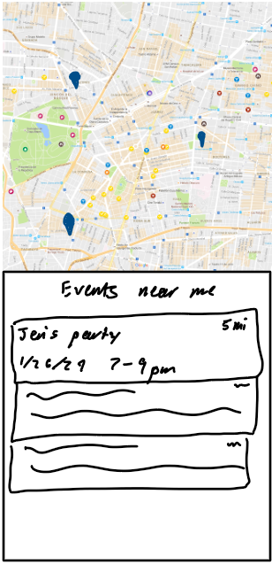
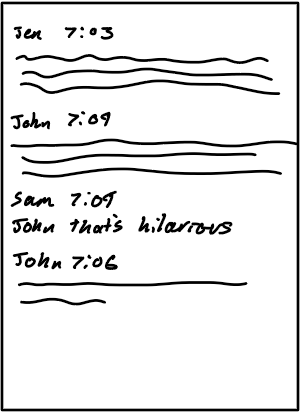
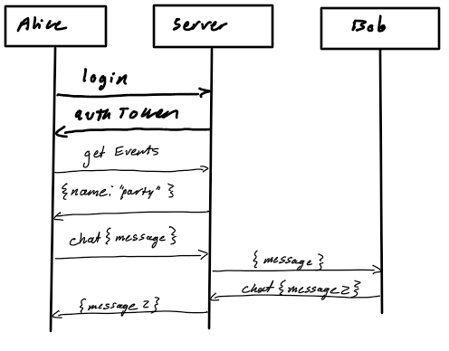

# There - Social Media
[My Notes](notes.md)

## Description deliverable

### Elevator pitch
Imagine connecting with others at events in real-time, where physical presence unlocks exclusive conversations. With "There," events become more than just memories – they become immersive experiences. Here's how it works: Events are marked geographically, ensuring that only those physically present can engage in the chat. Share the excitement, laughter, and moments that define the event with a select audience, fostering genuine connections that transcend the virtual world. Meanwhile, everyone else is going to wake up the next morning with a bad case of FOMO. Some message can even be marked public igniting the curiosity of those not in attendance even more while they see all the messages they missed out on. So don't miss out. Be "There".

### Design
A list of events near you, an explore page.  

A chat for someone who did not attend. For those that did it will look like a normal chat.  

Sequence Diagram  
  

### Key feature
- Secure login over HTTPS
- Setup events at a given time and date as well as location
- Search for events near your geographical location
- Chat with people live while at an event physically
- See old chats from events (if you did not attend only the public chats)

### Technologies
I am going to use the required technologies in the following ways.

- **HTML** - Uses correct HTML structure for application. Pages will include:
  - create account
  - login
  - explore nearby events
  - create new event
  - chat at events
- **CSS** - Application styling that looks good on different screen sizes, uses good whitespace, color choice and contrast.
- **JavaScript** - Provides login, location information, display events, display chat.
- **Service** - Backend service with endpoints for:
  - login
  - retrieving events
  - creating events
  - retrieving chats
  - creating chats
- **DB/Login** - Store users, events, chats in database. Register and login users. Credentials securely stored in database. Can't chat unless authenticated.
- **WebSocket** - As each user sends chat messages, all users will see the message update.
- **React** - Application ported to use the React web framework.

## HTML deliverable

For this deliverable I built out the structure of my application using HTML.

- **HTML pages** - Five HTML pages that represent the ability to view and create events, see all events, see the user's events, and sign in/sign up.
- **Links** - Clicking on an event takes you to the chat, header links the sign in, profile, and new event together. Signing in takes you to your profile.
- **Text** - Lorem ipsums as a place holder of event details and chat messages.
- **Images** - Google maps image to represent the live visualization of google maps.
- **DB/Login** - Input box and submit button for login. The events and their chats represent data pulled from the database.
- **WebSocket** - The chat messages will be updated live by websockets. 